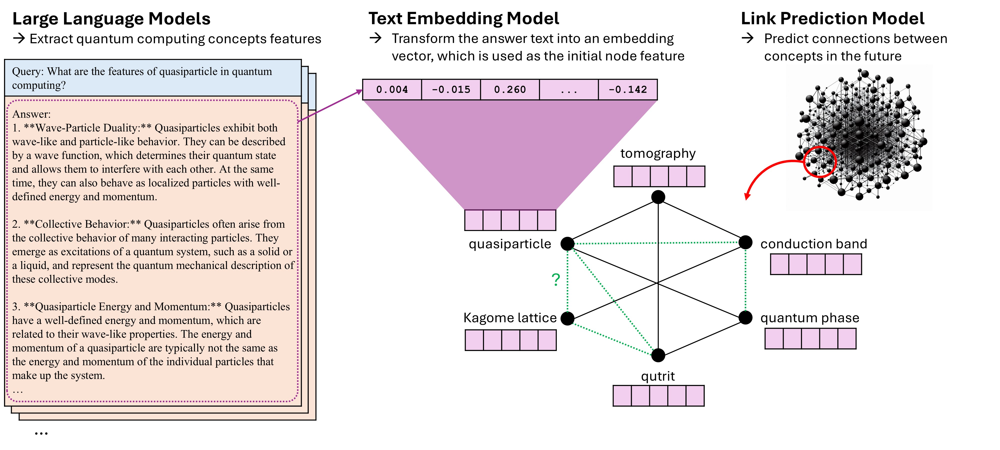

# QC-LinkPrediction

This is the official code of the paper:

[Enhancing Future Link Prediction in Quantum Computing Semantic Networks through LLM-Initiated Node Features](TBA)

## Overview
The project aims to initialize node features in Graph Neural Networks (GNNs) using Large Language Models (LLMs). 
We used the Quantum Computing Semantic Network for the future link prediction task to to evaluate our approach.

*Figure: The overview of future link predictions in the quantum computing semantic network using LLM-generated initial node features. In the example graph, solid lines indicate past established connections, while dotted lines represent a subset of potential future connections to be predicted by the model for relevance.*

## Reproduction
To reproduce the results of the experiments, use the bash scripts.

## Citation
TBA