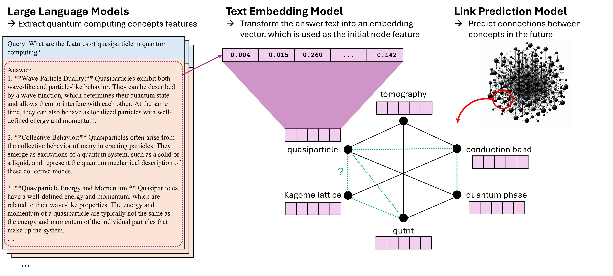

# QC-LinkPrediction

This is the official code of the paper:

[Enhancing Future Link Prediction in Quantum Computing Semantic Networks through LLM-Initiated Node Features](https://aclanthology.org/2025.coling-industry.25/)


## Overview
The project aims to initialize node features in Graph Neural Networks (GNNs) using Large Language Models (LLMs). 
We used the Quantum Computing Semantic Network for the future link prediction task to to evaluate our approach.


*Figure: The overview of future link predictions in the quantum computing semantic network using LLM-generated initial node features. In the example graph, solid lines indicate past established connections, while dotted lines represent a subset of potential future connections to be predicted by the model for relevance.*


## Reproduction
To reproduce the results of the experiments, use the bash scripts. The reference code for GNNs: [HeaRT](https://github.com/Juanhui28/HeaRT/tree/master)


## Citation
```bibtex
@inproceedings{park-etal-2025-enhancing,
    title = "Enhancing Future Link Prediction in Quantum Computing Semantic Networks through {LLM}-Initiated Node Features",
    author = "Park, Gilchan  and
      Baity, Paul  and
      Yoon, Byung-Jun  and
      Hoisie, Adolfy",
    editor = "Rambow, Owen  and
      Wanner, Leo  and
      Apidianaki, Marianna  and
      Al-Khalifa, Hend  and
      Eugenio, Barbara Di  and
      Schockaert, Steven  and
      Darwish, Kareem  and
      Agarwal, Apoorv",
    booktitle = "Proceedings of the 31st International Conference on Computational Linguistics: Industry Track",
    month = jan,
    year = "2025",
    address = "Abu Dhabi, UAE",
    publisher = "Association for Computational Linguistics",
    url = "https://aclanthology.org/2025.coling-industry.25/",
    pages = "295--304",
    abstract = "Quantum computing is rapidly evolving in both physics and computer science, offering the potential to solve complex problems and accelerate computational processes. The development of quantum chips necessitates understanding the correlations among diverse experimental conditions. Semantic networks built on scientific literature, representing meaningful relationships between concepts, have been used across various domains to identify knowledge gaps and novel concept combinations. Neural network-based approaches have shown promise in link prediction within these networks. This study proposes initializing node features using LLMs to enhance node representations for link prediction tasks in graph neural networks. LLMs can provide rich descriptions, reducing the need for manual feature creation and lowering costs. Our method, evaluated using various link prediction models on a quantum computing semantic network, demonstrated efficacy compared to traditional node embedding techniques."
}
```